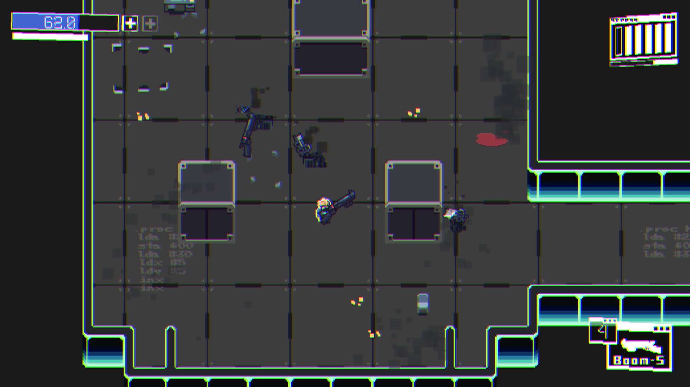
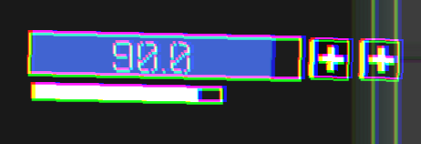
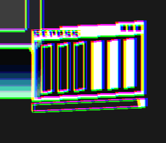
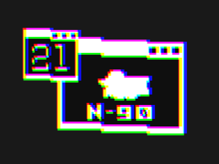

<h2 align="center">Top Down Shooter Prototype</h2>
 

This is a document to give an overview regarding the controls and mechanics that are included in [videogame name yet to be selected] 

<h2 align="center">Controls</h2>

 Movement        => W,A,S,D 

 Shooting        => Left click 

 Pick weapon     => Space bar 

 Bullet time     => Shift 

 Recover health  => Z 

<h2 align="center">Mechanics</h2>

<h3 align="center"> Health and bullet time</h3>

Player health is displayed at the top-left of the screen. Press <b>Z</b> to recover health using the two health 
packs indicated on the right side of the health bar. Use them wisely, as they are limited. 
 
Press <b>Shift</b> to enter bullet time (slow motion), which costs 5 health points. The bullet time gauge, 
located below the health bar, will deplete until it reaches zero, exiting bullet time. You can also exit  
bullet time by pressing <b>Shift</b> again, but you cannot re-enter until the gauge is full.

 

 

<h3 align="center">Stress system</h3>

The stress system increases the player's damage based on the number of enemies killed in a 
short time. Prioritize weaker enemies to build up stress and deal more damage to stronger ones. The  
stress meter, displayed at the top-right, has 6 bars indicating the current level, with a timer bar below 
it. To raise or maintain the stress level, kill enemies before the timer runs out. If the timer reaches  
zero without a kill, the stress level resets. 

 

 

<h3 align="center">Weapon management</h3>

The player can carry one weapon at a time. Press the <b>Space</b> bar to pick up a new weapon, dropping 
the current one. The weapon UI at the bottom-right displays the current weapon and remaining 
rounds. Weapons with available rounds shine, while empty ones do not. 

 
